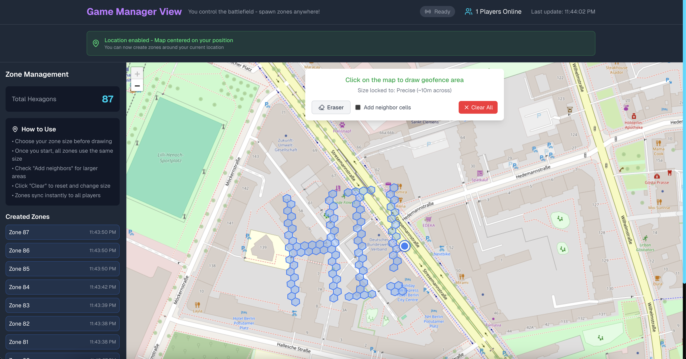
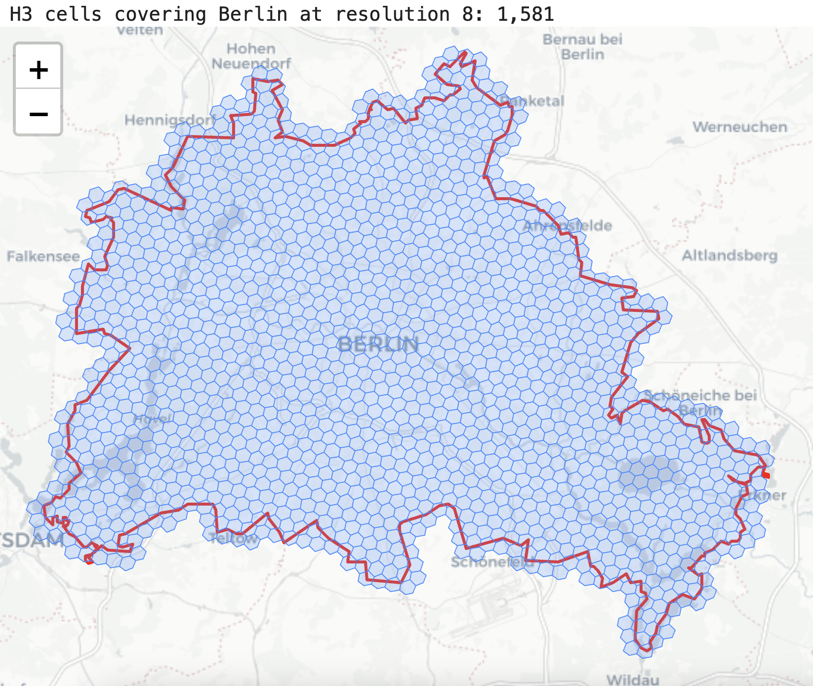

<!-- ────────────────────────────────────────────────────────────── -->

# ZK Shroud Arena

**ZK Shroud Arena** is a zero-knowledge, location-privacy **battle royale** game.  
Players must stay within a dynamically defined safe zone—composed of any combination of **H3 cells**—to earn rewards. The zone can change at any time, but **player locations remain completely private**.

This is made possible by our Rust + Arkworks-based **`PointInMapCircuit`**, which proves that a player is inside the allowed area without revealing their actual coordinates. The circuit supports **high-fidelity custom maps** and generates **proofs in under 1 second**, making it possible to be applied with real-time applications or even IoT-constrained environments.

## Overview

This project consists of the following components

1. **Frontend Application**

   - Built using TypeScript + Next.js.
   - Real-time map rendering with H3 hex grid overlays.
   - Dynamic zone updates and player positioning visualization.
   - Seamless WebSocket integration for live state sync.
   - Real-time HUD with health, coins, zone timer, and player count.
   - Live ZK proof status display with backend connection indicators.

2. **Backend ZK Proof Service**

   - Built using Rust + Actix-web.
   - Hosts /prove, /verify, and /healthz endpoints.

3. **ZK Circuit**

   - Built using Rust + Arkworks zero-knowledge libraries.
   - Uses Groth16 and the BN254 curve to optimize proof generation time.
   - Configurable maximum number of H3 cells (currently 1024 cells).
   - Works with any kind of convex polygon, but we chose the H3 grid system for better human readability and compatibility.
   - ~42k constraints.
   - ~300 ms proof time on M1 Pro 16GB.

## Showcase




- Players must remain within dynamic zones to earn rewards.

- Zones are shaped using H3 hexagonal cells, supporting complex safe zones composed of any combination of hexagons.

- Player coordinates are never revealed—only ZK proofs are submitted every second.

- The game manager can update zones mid-game without ever seeing player positions.

## What This Solves

As of now, the authors are not aware of any proof-of-location project that accepts a list of multiple convex polygons as public input; existing projects handle only a single, trivial shape such as a circle, square, or (at most) a heptagon. Our circuit supports any convex polygon, with a configurable `CIRCUIT_MAX_VERTICES` (currently 6). It also accepts a polygon list of up to 1,024 entries, which is sufficient for many complex maps representing regions or entire countries, and this limit can be raised via `CIRCUIT_MAX_POLYGON_HASHES` if more is needed. Increasing either parameter adds only minimal constraints. The circuit is written in Rust, providing compatibility with the ZK ecosystem, and is MIT-licensed, so it's free for anyone to use.

For example, at resolution 8, it takes 1,581 H3 cells to represent the area of Berlin.



## Circuit Constraints

The more H3 cells you include, the higher the fidelity your map achieves. The constraint count grows by 3 for each H3 cell, which means if you create a circuit that allows 8096 cells, the constraint count will only be around ~64k, about 50% larger than the current circuit used in this demo (1024 H3 cell count), and the proof time should still remain below 1 second (near real-time).

| H3 Cell Count | R1CS Constraints |
| ------------- | ---------------- |
| 1024          | 42052            |
| 2048          | 45124            |

## Circuit Performance

We have measured the performance of the circuit on two platforms: my MacBook M1 Pro with 16 GB of RAM and a GCP instance in europe-north2 (Stockholm, Sweden, Europe) with 8 vCPUs and 16 GB of RAM. The performance appears to be better when tested on macOS and should be much better on newer hardware like M4 chips. If placed in a Raspberry Pi 5, it is expected that the proof generation time should still definitely be within 5 seconds, enabling zk proof generation with a small-footprint IoT device that can be installed anywhere.

| HW / Location                               | Operation |                 Time |
| ------------------------------------------- | --------- | -------------------: |
| **M1 Pro 16 GB**                            | Prove     |           **300 ms** |
|                                             | Verify    |             **5 ms** |
| **GCP c4-highcpu-8** <br>Berlin → Stockholm | Prove     | **440 ms** (+60 RTT) |
|                                             | Verify    |  **90 ms** (+60 RTT) |

## Setup

The frontend application will be available at http://localhost:3001

The backend ZK proof service should be running at http://localhost:8080

### Frontend Application

#### Setup

```bash
cd src/frontend

npm install

npm run dev
```

##### Run tests

```bash
npm run test
```

##### Build for production

```bash
npm run build
```

### Backend ZK Proof Service

#### Setup (macOS)

```bash
brew install cmake pkgconf

cargo run --release
```

#### Setup (Ubuntu)

```bash
apt install build-essential cmake pkg-config libsqlite3-dev sqlite3

cargo run --release
```

## Backend test

Integration spec is in `src/specs`, you can quickly run to check backend with these commands

```
cd src/specs
npm install
npm run test
```

## Backend Usage

### Prove

`POST /prove`

**Request Body:**

```json
{
  "lat": 40.68953953,
  "lon": -74.04016093,
  "resolution": 10,
  "h3_map": ["8a2a1072b5affff", "8a2a1072b51ffff", "8a2a1072b50ffff"]
}
```

**Response:**

```json
{
  "ok": true,
  "proof": {
    "a": "Ekm99nhbAInwbt9TF6IoJlQJp0Ta8Bj/FCxfUKe/Ohv7f+HgrpX38tapXrOjjyHxfHlVYSAhkdIWypPpOsz1ow==",
    "b": "BlnzwCyUabZw2WI+LEz/d/yZs+IDeiEwI+e8rtbZiQSMxG1sumHK9ldImYv9mvZL1/o+IOV+F53MxPxkOiBkHAw2RcmUt6rydVusj5KMjdAxA4jml+e9DsjmAVeQj0Uns7zgHwgs71EDCORaeZTRc+LU5h9GUGA7Ku/YZJE3Bqk=",
    "c": "CqpNJynMnZnbpCMwG70/RbJXxluulZFsJNlnT8ufQRk/KnQhcZbo7UXAx2F4ZHrwptIsS/gLqkPyHOekx56mnw=="
  },
  "public_inputs": [
    "AQAAAAAAAAAAAAAAAAAAAAAAAAAAAAAAAAAAAAAAAAA=",
    "LqavhL5cVeGNPdHfbrPmgc6mPxEfXI9GR3ld5cf0tCM=",
    "TnoFS0uSTxMJcQJ0yf8yf+h5t5ZYH7vxdm18/cC6gBg=",
    "HsxVeSufR72lsaelqsPX6/D0h1jNWn1Wz93RwMGQ0Ac=",
    "AAAAAAAAAAAAAAAAAAAAAAAAAAAAAAAAAAAAAAAAAAA=",
    "AAAAAAAAAAAAAAAAAAAAAAAAAAAAAAAAAAAAAAAAAAA=",
    ...
  ]
}
```

---

### Verify

`POST /verify`

**Request Body:**

```json
{
  "proof": {
    "a": "Ekm99nhbAInwbt9TF6IoJlQJp0Ta8Bj/FCxfUKe/Ohv7f+HgrpX38tapXrOjjyHxfHlVYSAhkdIWypPpOsz1ow==",
    "b": "BlnzwCyUabZw2WI+LEz/d/yZs+IDeiEwI+e8rtbZiQSMxG1sumHK9ldImYv9mvZL1/o+IOV+F53MxPxkOiBkHAw2RcmUt6rydVusj5KMjdAxA4jml+e9DsjmAVeQj0Uns7zgHwgs71EDCORaeZTRc+LU5h9GUGA7Ku/YZJE3Bqk=",
    "c": "CqpNJynMnZnbpCMwG70/RbJXxluulZFsJNlnT8ufQRk/KnQhcZbo7UXAx2F4ZHrwptIsS/gLqkPyHOekx56mnw=="
  },
  "public_inputs": [
    "AQAAAAAAAAAAAAAAAAAAAAAAAAAAAAAAAAAAAAAAAAA=",
    "LqavhL5cVeGNPdHfbrPmgc6mPxEfXI9GR3ld5cf0tCM=",
    "TnoFS0uSTxMJcQJ0yf8yf+h5t5ZYH7vxdm18/cC6gBg=",
    "HsxVeSufR72lsaelqsPX6/D0h1jNWn1Wz93RwMGQ0Ac=",
    "AAAAAAAAAAAAAAAAAAAAAAAAAAAAAAAAAAAAAAAAAAA=",
    "AAAAAAAAAAAAAAAAAAAAAAAAAAAAAAAAAAAAAAAAAAA=",
    ...
  ]
}
```

**Response:**

```json
{
  "ok": true // false if fails to verify
}
```

## Acknowledgement

The idea of using H3 cells to represent complex areas came from the paper [Zero-Knowledge Location Privacy via Accurate Floating-Point SNARKs](https://eprint.iacr.org/2024/1842.pdf) and its [reference implementation](https://github.com/tumberger/zk-Location/tree/main). We were not familiar with the H3 grid system until we discovered this work. Our implementation, however, is entirely different from theirs. It is written in Rust rather than Go, avoids floating-point arithmetic because of its complexity, and does not derive an H3 cell from latitude and longitude in-circuit with the “trigonometry black magic” used in the paper. Instead, our circuit verifies location by checking whether a point lies inside a convex polygon using only subtractions and multiplications.
